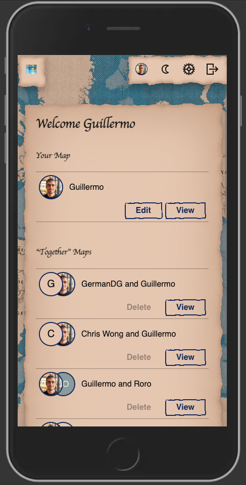

# Travelmap

 [](https://www.repostatus.org/#active)

**[https://travelmap.guillermodlpa.com](https://travelmap.guillermodlpa.com)** - ⚠️ Site not working because Planetscale discontinued its free Hobby Plan.

Travelmap is a small web application that allows users to make a shareable map of visited countries and combine their maps with other users.

[](https://www.repostatus.org/#inactive)

| Some desktop views           | Some mobile views                    |
| -------------------------------------------------- | ------------------------------------------------ |
|  |  |
|  |  |

## Technologies

- Frontend: TypeScript, Next.js
  - UI Library: [Grommet](https://github.com/grommet/grommet)
  - [Vercel SWR](https://swr.vercel.app/) for data fetching
- Backend: TypeScript, NextJS
  - Implemented in this repository using Next.js in `pages/api`
  - [Prisma](https://www.prisma.io/) for ORM
    - Reminder: when making changes to the schema, remember to run `npx prisma generate`.
- Data: [Planetscale](https://planetscale.com/) (serverless MySQL)
  - Reminder: to push a schema up, use Prisma with `npx prisma db push`. It knows where to push thanks to the env var `DATABASE_URL` that you need to set in your `.env`
- Authentication: [Auth0](https://auth0.com/)
  - When users log in, there's an Auth0 Action executed that,
    - Upon registration, creates the user record and their map, and saves the user record ID in Auth0.
    - Sets the user record ID in the Auth0 token, so we can read it directly from the frontend with the hook `useUser`.
  - There are 2 applications configured, each with its variables defined in the environment variables file:
    - Frontend: it's a generic application, the one integrated with Next.js
    - Backend: it's a "Machine to Machine" application, used to interact with the Management API when needed, like when needing to delete a user account.
- Images: [Cloudinary](https://cloudinary.com/) to host and serve the profile pictures
- Testing:
  - End-to-end testing with [Cypress.](https://www.cypress.io/)
- Continuous Integration: GitHub Actions
  - Run the end-to-end tests. [See the workflow.](./.github/workflows/end_to_end_tests.yml)
- Hosting: [Vercel](https://vercel.com/)

## Development

Before it works locally, you'll need to set up accounts on the following services, and add their API keys and secrets to your `.env.local` file:

- Mapbox Studio
- Cloudinary
- Auth0. [See instructions](https://github.com/auth0/nextjs-auth0#getting-started)

Once that's done, this is a Next.js app, so you can run it simply by:

```bash
npm install
npm run dev
```

## End-to-end tests with Cypress

User authentication with Auth0 is achieved leveraging [sir-dunxalot/cypress-nextjs-auth0](https://github.com/sir-dunxalot/cypress-nextjs-auth0).

The environment variables for tests are stored in `cypress.env.json`. This file isn't git tracked. There's an empty copy, [cypress.env.dist.json](./cypress.env.dist.json)

Run `npx cypress open` to open Cypress and run any spec.

During login, there's an Auth0 action that reaches to an API endpoint of Travelmap. In non-production, this is normally configured to hit https://preview.travelmap.guillermodlpa.com. That's why the repository needs to have a `preview` branch, more or less in sync with `main`, that Vercel will deploy to a Preview environment that uses the dev DB. Vercel doesn't seem to support to deploy the same branch to two environments (with different env vars).

In the dev DB and Auth0 tenant, there are 2 users used for testing:

* `newtestuser@example.com`, a user that hasn't gone through the onboarding.
* `testuser@example.com`, a user that has gone through the onboarding and has edited their map.


### Planetscale reference for creating database

Keeping it here for future reference.

Commands to set up the development database:

```sh
# Create database
pscale database create travelmap-dev --org travelmap
# Create `main` branch and password for it
pscale password create travelmap-dev main main-password --org travelmap

# Then copy the values in the DATABASE_URL env var, with format `mysql://[username]:[password]@[host]/travelmap-dev?sslaccept=strict`

# Push the schema
DATABASE_URL='mysql://[username]:[password]@[host]/travelmap-dev?sslaccept=strict' npx prisma db push

# Promote branch to production
pscale branch promote travelmap-dev main --org travelmap
```
